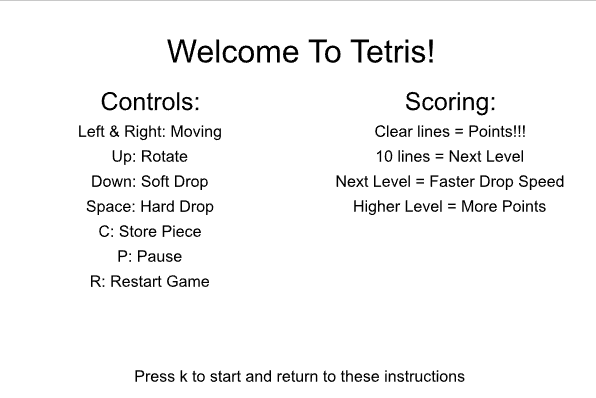
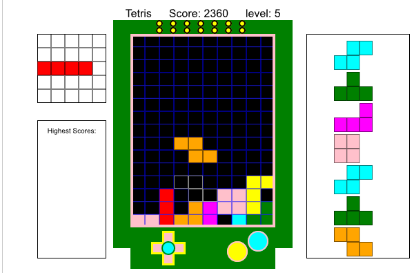
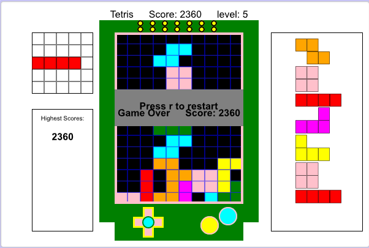

# My Tetris-Project
A Tetris game I created using Python and CMU CS Academy.

Play the Game

[Play Tetris on CMU CS Academy](https://academy.cs.cmu.edu/sharing/peruChicken211693)

Features
- Classic Tetris including:
- Piece rotation,
- Line clearing,
- Score tracking,
- Different shapes,
- Seven-piece bag randomization.

Technologies
- Python
- CMU CS Academy

ScreenShots

 - These are the instructions

.png)
- This is an example of the gameplay.
- On the right, you can see the next seven pieces.
- On the top-left, you can see which piece is currently stored.
- The board itself was created using a 2D list of booleans.

- Each tile within the board contains a False value if there isn't a piece inside.
- On every tick, the current piece slides down one tile.
- Once enough rows have been cleared, the player will move onto the next level.
- This hastens the ticking speed; however, it also adds a multiplier to the score.

- Once a piece can no longer placed, the player loses.
- If the player's score is high enough, they may be able to add it to the list of highscores.
- The player may choose to restart by pressing r.
